# Table of Contents

- [Table of Contents](#table-of-contents)
- [Motivation](#motivation)
  - [Merging relational data](#merging-relational-data)
    - [Handling ambiguous variables](#handling-ambiguous-variables)
  - [Merging interactively](#merging-interactively)
- [Configure possible selection](#configure-possible-selection)
  - [picks and choices/selected](#picks-and-choicesselected)
  - [Relationship between `picks` elements](#relationship-between-picks-elements)
  - [Example settings](#example-settings)
    - [Strict variables picks](#strict-variables-picks)
    - [Dynamic variables choices](#dynamic-variables-choices)
    - [Dynamic variables from multiple datasets](#dynamic-variables-from-multiple-datasets)
    - [Dynamic everything](#dynamic-everything)
  - [Implementation in `teal_module`](#implementation-in-teal_module)
    - [App example](#app-example)
    - [Select specific variable(s) from a specific dataset](#select-specific-variables-from-a-specific-dataset)
    - [Select specific variable(s) from a selected dataset](#select-specific-variables-from-a-selected-dataset)
    - [Select unknown variable(s) from a selected dataset](#select-unknown-variables-from-a-selected-dataset)
    - [filtering by any variable](#filtering-by-any-variable)
  - [Conversion from to data-extract-spec](#conversion-from-to-data-extract-spec)
    - [Issues with `data_extract_spec`](#issues-with-data_extract_spec)
      - [Bad encapsulation](#bad-encapsulation)
      - [Hard to extend](#hard-to-extend)

# Motivation

## Merging relational data

Consider following tables `orders`, `order_items`, `products`, `customers` connected with join keys
following sql convention `{child}.{$parent}_id = {$parent+"s"}.id`, for example
`orders.customer_id = customers.id`. `teal.data` setup would look like this:

<details>
<summary>Sample data setup with relational tables and join keys</summary>

```r
library(teal.data)
data <- within(teal_data(), {
  customers <- tibble::tribble(
    ~id, ~name, ~age, ~country,
    1, "Alice Johnson", 30, "USA",
    2, "Bob Smith", 25, "Canada",
    3, "Charlie Brown", 35, "UK",
    4, "David Wilson", 28, "Australia",
    5, "Emma Davis", 32, "USA",
    6, "Frank Miller", 27, "Canada",
    7, "Grace Taylor", 29, "UK",
    8, "Henry Clark", 33, "Australia",
    9, "Isabella Martinez", 26, "USA",
    10, "Jack Thompson", 31, "Canada"
  )

  orders <- tibble::tribble(
    ~id, ~customer_id, ~order_date, ~total_amount,
    101, 1, as.Date("2024-01-15"), 250.00,
    102, 1, as.Date("2024-02-01"), 150.00,
    103, 2, as.Date("2024-02-10"), 125.00,
    104, 3, as.Date("2024-02-15"), 200.00,
    105, 4, as.Date("2024-02-20"), 175.00,
    106, 5, as.Date("2024-03-01"), 300.00,
    107, 6, as.Date("2024-03-05"), 50.00,
    108, 7, as.Date("2024-03-10"), 225.00,
    109, 8, as.Date("2024-03-12"), 100.00,
    110, 9, as.Date("2024-03-15"), 275.00,
    111, 10, as.Date("2024-03-18"), 125.00,
    112, 2, as.Date("2024-03-20"), 150.00
  )

  order_items <- tibble::tribble(
    ~id, ~order_id, ~product_id, ~quantity, ~unit_price, ~total_price,
    201, 101, 1, 2, 100.00, 200.00,
    202, 101, 2, 1, 50.00, 50.00,
    203, 102, 2, 3, 50.00, 150.00,
    204, 103, 2, 1, 50.00, 50.00,
    205, 103, 3, 1, 75.00, 75.00,
    206, 104, 1, 2, 100.00, 200.00,
    207, 105, 3, 2, 75.00, 150.00,
    208, 105, 2, 1, 50.00, 50.00,
    209, 106, 1, 3, 100.00, 300.00,
    210, 107, 2, 1, 50.00, 50.00,
    211, 108, 1, 1, 100.00, 100.00,
    212, 108, 3, 2, 75.00, 150.00,
    213, 109, 2, 2, 50.00, 100.00,
    214, 110, 1, 2, 100.00, 200.00,
    215, 110, 3, 1, 75.00, 75.00,
    216, 111, 2, 2, 50.00, 100.00,
    217, 111, 1, 1, 100.00, 100.00,
    218, 112, 3, 2, 75.00, 150.00
  )

  order_files <- tibble::tribble(
    ~id, ~order_id, ~file_name, ~file_type,
    301, 101, "invoice_101.pdf", "invoice",
    302, 102, "receipt_102.pdf", "receipt",
    303, 103, "invoice_103.pdf", "invoice",
    304, 104, "receipt_104.pdf", "receipt",
    305, 105, "invoice_105.pdf", "invoice",
    306, 106, "receipt_106.pdf", "receipt",
    307, 107, "invoice_107.pdf", "invoice",
    308, 108, "receipt_108.pdf", "receipt",
    309, 109, "invoice_109.pdf", "invoice",
    310, 110, "receipt_110.pdf", "receipt",
    311, 111, "invoice_111.pdf", "invoice",
    312, 112, "receipt_112.pdf", "receipt"
  )

  products <- tibble::tribble(
    ~id, ~name, ~price, ~category, ~stock_quantity,
    401, "Laptop Pro", 100.00, "Electronics", 15,
    402, "Wireless Mouse", 50.00, "Electronics", 50,
    403, "Office Chair", 75.00, "Furniture", 8
  )

  product_components <- tibble::tribble(
    ~id, ~product_id, ~component_name, ~component_type, ~quantity_required, ~cost,
    501, 401, "CPU", "Processor", 1, 25.00,
    502, 401, "RAM", "Memory", 2, 15.00,
    503, 401, "SSD", "Storage", 1, 20.00,
    504, 401, "Screen", "Display", 1, 30.00,
    505, 402, "Optical Sensor", "Sensor", 1, 8.00,
    506, 402, "Wireless Module", "Connectivity", 1, 12.00,
    507, 402, "Battery", "Power", 1, 5.00,
    508, 403, "Steel Frame", "Structure", 1, 35.00,
    509, 403, "Cushion", "Comfort", 1, 20.00,
    510, 403, "Wheels", "Mobility", 5, 3.00
  )
})

join_keys(data) <- join_keys(
  join_key("customers", keys = "id"),
  join_key("orders", keys = c("id")),
  join_key("products", keys = c("id")),
  join_key("product_components", keys = c("id")),
  # foreign keys
  join_key("customers", "orders", keys = c(id = "customer_id")),
  join_key("products", "order_items", keys = c(id = "product_id")),
  join_key("products", "product_components", keys = c(id = "product_id")),
  join_key("orders", "order_items", keys = c(id = "order_id"))
)

print(join_keys(data))
```

</details>

Imagine now a scenario of a `ggplot` where one wants to select `x`, `y`, `color`, `facet_rows`,
`facet_cols` from any variable in any dataset.

<details>
<summary>Example ggplot with dynamic variable selection</summary>

```r
ggplot(
  data = ?,
  aes(
    x = !!sym(input$x), # orders.order_date
    y = !!sym(input$y), # order_items.total_price
    color = !!sym(input$color) # products.category
  )
) +
  geom_line() +
  facet_grid(
    vars(!!sym(input$facet_rows)) # customers.country
  )
```

</details>

In order to create above visualization, datasets need to be merged as `ggplot::aes` is related to single 
data object. Problem is solvable as `teal.data` has enough information to determine correct 
merge call based and selected variables and `join_keys` (describing relationships between datasets).

Using `dplyr` only we need to perform following merge operation given that following variables have 
been selected:

- x: `orders.order_date`
- y: `order_items.order_items.total_price`
- color: `products.category`
- facet_rows: `customers.country`

<details>
<summary>Merge operation using dplyr joins</summary>

```r
data_w_merged <- within(data, {
  anl <- dplyr::select(orders, id, customer_id, order_date) %>%
    dplyr::left_join(dplyr::select(order_items, order_id, product_id, total_price), by = c(id = "order_id")) %>%
    dplyr::left_join(dplyr::select(products, id, category), by = c(product_id = "id")) %>%
    dplyr::left_join(dplyr::select(customers, id, country), by = c(customer_id = "id"))
})
```

</details>

Now `anl` can produce desired visualization

<details>
<summary>Creating visualization with merged dataset</summary>

```r
# Create the visualization with merged data - sum moved to ggplot
data_w_plot <- within(data_w_merged, {
  library(ggplot2)

  # Create ggplot with sum calculation inside
  plot <- ggplot(
    data = anl,
    aes(
      x = order_date,
      y = total_price,
      color = category
    )
  ) +
    geom_line() +
    facet_grid(
      rows = vars(country),
      labeller = label_both
    )
  
  print(plot)
})

get_outputs(data_w_plot)[[1]]
```

</details>

### Handling ambiguous variables

When merging datasets containing duplicated variable names `dplyr::*_join(suffix = c(".x", ".y"))` automatically
adds a suffix to the columns, so that names are alway unique.

## Merging interactively

Developing system which can interactively handle merge is a challenging task not only for a reasons described above
but also due to additional layers which need to control described operation. These layers include:

1. Providing an API for app-developer to enable and set specific merge configuration.
2. Handling reactive relationship between all inputs (dataset -> variable -> value) and avoid unnecessary triggers.
3. Providing robust, easy to use merge-modules which can handle weirdest app-developer needs (1) and provide meaningful information to the app-user about consequences of the data/variable selections.

# Configure possible selection

## picks and choices/selected

We came with an idea of `picks` which allows app-developer to specify `datasets`, `variables` and `values` to be 
selected by app-user during an app run. Each of them is based on the idea of `choices/selected` where app-developer
provides `choices` and what is `selected` by default. App-user though changes `selected` interactively.

```mermaid
graph TB
    subgraph AppDeveloper["👨‍💻 App Developer (Configuration Time)"]
        Dev[App Developer]
    end

    subgraph Variables["variables()"]
        VAR_Choices["choices<br/>(choices set by app-developer)"]
        VAR_Selected["selected<br/>(default set by app-developer)"]
    end

    subgraph AppUser["👤 App User (Runtime)"]
        User[App User]
        UI["selectInput<br/>(UI Component)"]
    end

    Dev -->|"sets choices"| VAR_Choices
    Dev -->|"sets default selected"| VAR_Selected
    VAR_Choices -->|"displayed in"| UI
    VAR_Selected -->|"initial value in"| UI
    UI -->|"presents choices"| User
    User -->|"changes selection"| VAR_Selected

    classDef devStyle fill:#e1f5ff,stroke:#0066cc,stroke-width:2px
    classDef userStyle fill:#fff4e1,stroke:#cc6600,stroke-width:2px
    classDef choicesStyle fill:#d4edda,stroke:#28a745,stroke-width:2px
    classDef selectedStyle fill:#fff3cd,stroke:#ffc107,stroke-width:2px

    class Dev devStyle
    class User,UI userStyle
    class VAR_Choices choicesStyle
    class VAR_Selected selectedStyle
```




New design bases on an idea that a module can consume its arguments referring to any variable in any dataset. Consider following example, where: 
- a module uses `x`, `y` and `facet` arguments to create an interactive inputs,
- user can select a variable from any dataset for `x`, `y`, `facet` 
- visualization will be build on a merged dataset containing these three variables.

```r
# pseudocode
tm_example <- function(x, y, facet) {
  ui = function(id, x, y, facet) ...., # inputs will be here
  server = function(id, x, y, facet) {
    moduleServer(id, function(input, output, session) {
      output$plot <- renderPlot({
        merged_dataset |>
          ggplot(
            aes(
              x = <selected x var>,
              y = <selected y var>
            )          
          ) + geom_point() + facet_wrap(vars(<selected facet var>))
      })
    })
  }
}
```

To provide choices and default selection for `x`, `y` and `facet` we propose following api:

<details>
<summary>Proposed API using <code>picks()</code> for variable selection</summary>

```r
# pseudocode
tm_example(
  x = picks(
    datasets(<choices>, <selected>),
    variables(<choices>, <selected>)
  ),
  y = picks(
    datasets(<choices>, <selected>),
    variables(<choices>, <selected>)
  ),
  facet = picks(
    datasets(<choices>, <selected>),
    variables(<choices>, <selected>)
  )
)
```

</details>

Where each function creates an object which holds the information consumed by the framework. `choices` and `selected` can be either:
- `tidyselect` selection_helpers (`?tidyselect::language`)
- Integer denoting index of column(s)
- explicit character denoting the name of the objects/columns/level
 
## Relationship between `picks` elements

Each `picks` element is evaluated in a sequence starting from `datasets`. `selected` in one of them determines possible choices of the next one. For example:

If `datasets` is selected to be `iris`, then following variables's `choices` will be variables of iris. `selected` can't be something else than a `choices` and so on.


## Example settings

Please read carefully the code and see the description to understand how `picks` work. 

### Strict variables picks

`picks` below will create an input in the module where single variable can be selected from `c("Sepal.Length", "Sepal.Width")`. `multiple = FALSE` disallow user to select more than one choice.

<details>
<summary>Example: Strict variable picks with single selection</summary>

```r
picks(
  datasets(choices = "iris", selected = "iris"),
  variables(choices = c("Sepal.Length", "Sepal.Width"), selected = "Sepal.Length", multiple = FALSE)
)
```

</details>

### Dynamic variables choices

Following `picks` will create an input in the module where user will be able to select any variable from iris (any = `everything()`) and by default `1`-st will be selected. Be careful, setting explicit `selected` when `choices` throws a warning as it is not certain for example that `"Species" %in% everything()`.

<details>
<summary>Example: Dynamic variable choices with tidyselect</summary>

```r
picks(
  datasets(choices = "iris", selected = "iris"),
  variables(choices = tidyselect::everything(), selected = 1, multiple = FALSE)
)
```

</details>

### Dynamic variables from multiple datasets

Consider a situation when one wants to select a variable from either `iris` or `mtcars`. Instead of forcing app-developer to enumerate all possible choices for `iris` and `mtcars`. Following picks will create two related inputs for datasets and for variables. Input for variables will automatically update when dataset selection changes.

<details>
<summary>Example: Multiple datasets with dynamic variables</summary>

```r
picks(
  datasets(choices = c("iris", "mtcars"), selected = "iris"),
  variables(choices = tidyselect::everything(), selected = 1, multiple = FALSE)
)
```

</details>

### Dynamic everything

In extreme scenario also lists of datasets could be unknown. Or to avoid writing too much text, one can specify following `picks`.

<details>
<summary>Example: Fully dynamic dataset and variable selection</summary>

```r
picks(
  datasets(choices = tidyselect::where(is.data.frame), selected = 1),
  variables(choices = tidyselect::everything(), selected = 1, multiple = FALSE)
)
```

</details>


## Implementation in `teal_module`

`teal_module` will accept `x`, `y` and `facet` and hand-over them to both `ui` and `server`.

<details>
<summary>Module definition with picks arguments</summary>

```r
tm_example <- function(x, y, facet) {
  module(
    ui = ui_example,
    server = srv_example,
    ui_args = list(x = x, y = y, facet = facet),
    server_args = list(x = x, y = y, facet = facet)
  )
}
```

</details>

On the `ui` part it is necessary to call `picks_ui` for each `picks` object.

<details>
<summary>UI implementation with picks_ui</summary>

```r
ui_example <- function(id, x, y, facet) {
  ns <- NS(id)
  div(
    picks_ui(id = ns("x"), picks =  x),
    picks_ui(id = ns("y"), picks =  y),
    picks_ui(id = ns("facet"), picks =  facet),
    plotOutput(ns("plot"))
  )
}
```

</details>

In the `server`, `picks` are utilized in `picks_srv` which can be called per each pick, or for all at once (as in the example below).  `picks_srv` is used only to resolve dynamic choices/selected and to handle interaction between inputs. `selectors` contain a list of selected datasets/variables for each `pick`. In this example `selectors` structure looks like this:

```yaml
x: (reactiveVal)
  datasets: 
    choices: ...
    selected: ...
  variables: 
    choices: ...
    selected: ...
y: ...
facet: ...
```

To create a merged-dataset using information from app-user selection one needs to call `merge_srv`. `picks_srv` doesn't do anything else than controlling a selection for a number of reasons:

- One might want to use different set of `variables` to perform merge. For example, some might be controlled with `picks_ui/srv` and have an UI element and some might be fixed and added optionally to the `merge_srv(selectors)`.
- Before merge is performed, one might want to validate if the selection is correct from a module perspective.

`merge_srv` returns a list with two reactives:
- `data`: `teal_data` object with merged dataset and
- `merge_vars`: named list of variables. List is named after selector name, for example `merge_vars()$facet`

<details>
<summary>Server implementation with merge_srv</summary>

```r
srv_example <- function(id, data, x, y, facet) {
  moduleServer(id, function(input, output, session) {
    selectors <- picks_srv(data = data, picks =  list(x = x, y = y, facet = facet))

    merged <- merge_srv("merge", data = data, selectors = selectors)

    plot_q <- reactive({
      within(merged$data(),
        {
          merged %>%
            ggplot(aes(x = x, y = y)) +
            geom_point() +
            facet_wrap(vars(facet))
        },
        x = str2lang(merged$variables()$x),
        y = str2lang(merged$variables()$y),
        facet = str2lang(merged$variables()$facet)
      )
    })

    output$plot <- renderPlot({
      req(plot_q())
      rev(get_outputs(plot_q()))[[1]]
    })
  })
}
```

</details>

### App example

<details>
<summary>Complete working app example with relational data and dynamic merging</summary>

```r
devtools::load_all("teal.data")
devtools::load_all("teal.transform")
devtools::load_all("teal")
devtools::load_all("teal.modules.general")
library(dplyr)

data <- within(teal.data::teal_data(), {
  customers <- tibble::tribble(
    ~id, ~name, ~age, ~country,
    1, "Alice Johnson", 30, "USA",
    2, "Bob Smith", 25, "Canada",
    3, "Charlie Brown", 35, "UK",
    4, "David Wilson", 28, "Australia",
    5, "Emma Davis", 32, "USA",
    6, "Frank Miller", 27, "Canada",
    7, "Grace Taylor", 29, "UK",
    8, "Henry Clark", 33, "Australia",
    9, "Isabella Martinez", 26, "USA",
    10, "Jack Thompson", 31, "Canada"
  )

  orders <- tibble::tribble(
    ~id, ~customer_id, ~order_date, ~total_amount,
    101, 1, as.Date("2024-01-15"), 250.00,
    102, 1, as.Date("2024-02-01"), 150.00,
    103, 2, as.Date("2024-02-10"), 125.00,
    104, 3, as.Date("2024-02-15"), 200.00,
    105, 4, as.Date("2024-02-20"), 175.00,
    106, 5, as.Date("2024-03-01"), 300.00,
    107, 6, as.Date("2024-03-05"), 50.00,
    108, 7, as.Date("2024-03-10"), 225.00,
    109, 8, as.Date("2024-03-12"), 100.00,
    110, 9, as.Date("2024-03-15"), 275.00,
    111, 10, as.Date("2024-03-18"), 125.00,
    112, 2, as.Date("2024-03-20"), 150.00
  )

  order_items <- tibble::tribble(
    ~id, ~order_id, ~product_id, ~quantity, ~unit_price, ~total_price,
    201, 101, 401, 2, 100.00, 200.00,
    202, 101, 402, 1, 50.00, 50.00,
    203, 102, 402, 3, 50.00, 150.00,
    204, 103, 402, 1, 50.00, 50.00,
    205, 103, 403, 1, 75.00, 75.00,
    206, 104, 401, 2, 100.00, 200.00,
    207, 105, 403, 2, 75.00, 150.00,
    208, 105, 402, 1, 50.00, 50.00,
    209, 106, 401, 3, 100.00, 300.00,
    210, 107, 402, 1, 50.00, 50.00,
    211, 108, 401, 1, 100.00, 100.00,
    212, 108, 403, 2, 75.00, 150.00,
    213, 109, 402, 2, 50.00, 100.00,
    214, 110, 401, 2, 100.00, 200.00,
    215, 110, 403, 1, 75.00, 75.00,
    216, 111, 402, 2, 50.00, 100.00,
    217, 111, 401, 1, 100.00, 100.00,
    218, 112, 403, 2, 75.00, 150.00
  )

  order_files <- tibble::tribble(
    ~id, ~order_id, ~file_name, ~file_type,
    301, 101, "invoice_101.pdf", "invoice",
    302, 102, "receipt_102.pdf", "receipt",
    303, 103, "invoice_103.pdf", "invoice",
    304, 104, "receipt_104.pdf", "receipt",
    305, 105, "invoice_105.pdf", "invoice",
    306, 106, "receipt_106.pdf", "receipt",
    307, 107, "invoice_107.pdf", "invoice",
    308, 108, "receipt_108.pdf", "receipt",
    309, 109, "invoice_109.pdf", "invoice",
    310, 110, "receipt_110.pdf", "receipt",
    311, 111, "invoice_111.pdf", "invoice",
    312, 112, "receipt_112.pdf", "receipt"
  )

  products <- tibble::tribble(
    ~id, ~name, ~price, ~category, ~stock_quantity,
    401, "Laptop Pro", 100.00, "Electronics", 15,
    402, "Wireless Mouse", 50.00, "Electronics", 50,
    403, "Office Chair", 75.00, "Furniture", 8
  )

  product_components <- tibble::tribble(
    ~id, ~product_id, ~component_name, ~component_type, ~quantity_required, ~cost,
    501, 401, "CPU", "Processor", 1, 25.00,
    502, 401, "RAM", "Memory", 2, 15.00,
    503, 401, "SSD", "Storage", 1, 20.00,
    504, 401, "Screen", "Display", 1, 30.00,
    505, 402, "Optical Sensor", "Sensor", 1, 8.00,
    506, 402, "Wireless Module", "Connectivity", 1, 12.00,
    507, 402, "Battery", "Power", 1, 5.00,
    508, 403, "Steel Frame", "Structure", 1, 35.00,
    509, 403, "Cushion", "Comfort", 1, 20.00,
    510, 403, "Wheels", "Mobility", 5, 3.00
  )

  iris <- iris
  mtcars <- mtcars
  iris$id <- seq_len(nrow(iris))
  mtcars$id <- seq_len(nrow(mtcars))
  ADSL <- rADSL
  ADTTE <- rADTTE
  ADRS <- rADRS
  ADAE <- rADAE
  ADLB <- rADLB
  ADTR <- rADTR
})

join_keys(data) <- c(
  teal.data::default_cdisc_join_keys[c("ADSL", "ADTTE", "ADRS", "ADAE", "ADQS", "ADTR", "ADLB")],
  teal.data::join_keys(
    join_key("iris", keys = "id"),
    join_key("mtcars", keys = "id"),
    teal.data::join_key("customers", keys = "id"),
    teal.data::join_key("orders", keys = c("id")),
    teal.data::join_key("products", keys = c("id")),
    teal.data::join_key("product_components", keys = c("id")),
    # foreign keys
    teal.data::join_key("customers", "orders", keys = c(id = "customer_id")),
    teal.data::join_key("products", "order_items", keys = c(id = "product_id")),
    teal.data::join_key("products", "product_components", keys = c(id = "product_id")),
    teal.data::join_key("orders", "order_items", keys = c(id = "order_id")),
    # add missing keys
    teal.data::join_key("ADTR", "ADTR", keys = c("STUDYID", "USUBJID", "PARAMCD", "AVISIT")),
    teal.data::join_key("ADSL", "ADTR", keys = c("STUDYID", "USUBJID"))
  )
)

tm_example <- function(x, y, facet) {
  module(
    ui = ui_example,
    server = srv_example,
    ui_args = list(x = x, y = y, facet = facet),
    server_args = list(x = x, y = y, facet = facet)
  )
}

ui_example <- function(id, x, y, facet) {
  ns <- NS(id)
  div(
    picks_ui(id = ns("x"), picks =  x),
    picks_ui(id = ns("y"), picks =  y),
    picks_ui(id = ns("facet"), picks =  facet),
    plotOutput(ns("plot"))
  )
}

srv_example <- function(id, data, x, y, facet) {
  moduleServer(id, function(input, output, session) {
    selectors <- picks_srv(data = data, picks =  list(x = x, y = y, facet = facet))

    merged <- merge_srv("merge", data = data, selectors = selectors)

    plot_q <- reactive({
      within(merged$data(),
        {
          anl %>%
            ggplot(aes(x = x, y = y)) +
            geom_point() +
            facet_wrap(vars(facet))
        },
        x = str2lang(merged$variables()$x),
        y = str2lang(merged$variables()$y),
        facet = str2lang(merged$variables()$facet)
      )
    })

    output$plot <- renderPlot({
      req(plot_q())
      rev(get_outputs(plot_q()))[[1]]
    })
  })
}

app <- init(
  data = data,
  modules = modules(
     tm_example(
      x = picks(
        datasets("orders"),
        variables(selected = "order_date")
      ),
      y = picks(
        datasets("order_items"),
        variables(selected = "total_price")
      ),
      facet = picks(
        datasets("customers"),
        variables(selected = "country")

      )
    ),
    modules(
      label = "Display e2e configuration",
      tm_merge(
        label = "adam",
        inputs = list(
          a = picks(
            datasets("ADTTE"),
            variables(multiple = TRUE)
          ),
          b = picks(
            datasets(choices = tidyselect::where(is.data.frame), selected = "ADSL"),
            variables(is_categorical(min.len = 2, max.len = 20), selected = 1, multiple = TRUE)
          ),
          c = picks(
            datasets(tidyselect::everything(), "ADTTE"),
            variables(choices = c(AGE:ARM, PARAMCD), selected = AGE, multiple = TRUE)
          ),
          d = picks(
            datasets(choices = "ADRS", selected = "ADRS"),
            variables(choices = "PARAM", selected = "PARAM"),
            values(selected = tidyselect::everything(), multiple = TRUE)
          ),
          e = picks(
            datasets(selected = "ADSL"),
            variables(
              choices = variable_choices("whatever", subset = function(data) {
                idx <- vapply(data, is.factor, logical(1))
                names(data)[idx]
              })
            )
          )
        )
      ),
      tm_merge(
        label = "non adam",
        inputs = list(
          a = picks(
            datasets(
              choices = tidyselect::where(is.data.frame) & !tidyselect::starts_with("AD"),
              selected = "orders"
            ),
            variables(
              selected = "order_date",
              multiple = TRUE
            )
          ),
          b = picks(
            datasets(selected = "products"),
            variables(selected = "price", multiple = TRUE)
          ),
          c = picks(
            datasets(selected = "order_items"),
            variables(multiple = TRUE)
          )
        )
      )
    )
  )
)

shinyApp(app$ui, app$server, enableBookmarking = "server")
```

</details>

### Select specific variable(s) from a specific dataset

```
data_extract_spec(
  data = "iris"
  select = select_spec(
    choices = c("Sepal.Length", "Species"), 
    selected = "Species"
  )
)

# to
picks(
  datasets("iris", "iris"),
  variables(
    choices = c("Sepal.Length", "Species"), 
    selected = "Species"
  )
)

```


### Select specific variable(s) from a selected dataset

```
list(
  data_extract_spec(
    data = "iris"
    select = select_spec(
      choices = c("Sepal.Length", "Species"), 
      selected = "Species"
    )
  ),
  data_extract_spec(
    data = "mtcars"
    select = select_spec(
      choices = c("mpg", "cyl"), 
      selected = "mpg"
    )
  )
)

# to
picks(
  datasets(c("iris", "mtcars"), "iris"),
  variables(
    choices = c("Sepal.Length", "Species", "mpg", "cyl"), 
    selected = c("Species", "mpg")
  )
)
```

### Select unknown variable(s) from a selected dataset

```
list(
  data_extract_spec(
    data = "iris"
    select = select_spec(
      choices = variable_choices("iris"), 
      selected = first_choice()
    )
  ),
  data_extract_spec(
    data = "mtcars"
    select = select_spec(
      choices = variable_choices("mtcars"), 
      selected = first_choice()
    )
  )
)

# to
picks(
  datasets(c("iris", "mtcars"), "iris"),
  variables(
    choices = tidyselect::everything(), 
    selected = 1L
  )
)

```
### filtering by any variable

`picks` provides no equivalent to `filter_spec` feature. To achieve this, please create a `teal_transform_module` with
a filtering mechanism.

```
list(
  data_extract_spec(
    data = "iris"
    select = select_spec(
      choices = c("Sepal.Length", "Species"), 
      selected = first_choice()
    ),
    filter = filter_spec(
      vars = "Species",
      choices = c("setosa", "versicolor", "virginica"),
      selected = "setosa"
    ) 
  )
)

# to picks and transformators
picks(
  datasets("iris", "iris"),
  variables(
    choices = c("Sepal.Length", "Species"),
    selected = 1L
  )
)

# Apply filtering through teal_transform_module
transformators = teal_transform_module(
  ui = function(id) {
    ns <- NS(id)
    selectInput(
      ns("species"), 
      label = "Select species", 
      choices = c("setosa", "versicolor", "virginica"),
      selected = "setosa"
    )
  },
  server = function(id, data) {
    moduleServer(id, function(input, output, session) {
      reactive({
        req(input$species)
        within(
          data(), {
            iris <- iris %>% dplyr::filter(Species %in% !!filter_values)
          }, 
          filter_values = input$species)
      })
    })
  }
)

```

## Conversion from to data-extract-spec

`picks` will completelly replace `data_extract_spec` (des) and will be the only tool to select-and-merge 
in `teal` framework. So far des will be supported as soft deprecated. `help("as.picks")`
contains the information how to convert des into picks but in a limited scope.
- `data_extract_spec` (or a list of des) containing only `select_spec` are convertible 1:1 to the `picks`
- `filter_spec` is not convertible to `picks` as it variables used in filter can be different than variables selected in `select_spec`, thus hierarchical form of `picks` can't handle this case.
- `filter_spec` can be converted to `teal_transform_module` and used in `transformators` argument instead and we recommend to do so. `teal.transform::teal_transform_filter` provides a simplified way to create such `transformator`.


### Issues with `data_extract_spec`

API of `data_extract_spec` is bad encapsulation, hard to extend, confusing and easy to break.

#### Bad encapsulation

In `filter_spec` one can specify `choices = value_choices(dataname, subset = function(data))`, this is vulnerable
for multiple failures:

- `value_choices("dataname")` can be completelly different than `data_extract_spec(dataname)`, guess what happens? ;]
- `subset = function(data)` is a function of a dataset, it means that even if `vars = "Species"` has been provideed one still have to do `levels(data$Species)` instead of `levels(column)`

As you can see, there are few places where scope of the classes is not well separated which leads to:

- repeating same information on multiple levels of the hierarchy `data_extract_spec(dataname)` and `value_choices(dataname)`, `vars = "Species"`, `levels(data$Species)`
- Repeating the same information also requires to be cautious to have both places correctly specified, otherwise error will occur

```r
data_extract_spec(
  dataname = "iris",
  select = select_spec(
    choices = variable_choices(subset = function(data) names(data))
    selected = "Sepal.Length"
  ),
  filter = filter_spec(
    vars = "Species",
    choices = value_choices("iris, subset = function(data) levels(data$Species)),
    selected = first_choice()
  )
)
```

Conclusion: 

- `value_choices(data)` shouldn't have an argument `data` as it is "given" by the `data_extract_spec`. Same applies to `variable_choices(data)`.
- `value_choices(subset = function(data))` should be a function of column which is set in `filter_spec(vars)`

#### Hard to extend

Recently one user asked to make `data_extract_spec(datanames)` delayed, so that it will adjust automatically to the existing datasets when resolved. Problem is API allow to have des for multiple datasets only when one knows their names. It is just done by making a list-of-des. Following code will produce dropdown with "iris" and "mtcars" and app-user will be able to switch between datasets (switching between des)

```r
# pseudocode
list(
  data_extract_spec(dataname = "iris", ...),
  data_extract_spec(dataname = "mtcars", ...)
)
```

Proposition was that `dataname = dataset_choices()`, similar to the `filter_spec(vars = variable_choices())`. Let's consider how would it look like:

```r
data_extract_spec(
  dataname = dataset_choices(choices = all_datasets(), selected = first_choice()),
  select = select_spec(
    choices = variable_choices(dataname = ??, choices = function(x) names(data))
  )
  filter = filter_spec(
    vars = variable_choices(dataname = ??, choices = function(x) names(data)), # how to obtain delayed `dataname`
    choices = value_choices(dataname = ??, choices = function(x) data$?? |> levels()) # how to obtain delayed `vars`
  )
)
```

To achive this, package would have to be seriously refactored, to be able to do following:

```r
data_extract_spec(
  dataname = dataset_choices(choices = all_datasets(), selected = first_choice()),
  select = select_spec(
    choices = variable_choices(choices = function(x) names(data))
  ),
  filter = filter_spec(
    vars = variable_choices(choices = function(data) names(data)),
    choices = value_choices(choices = function(column) column |> levels())
  )
)
```

Let's just use above example and change function names:

```
picks(
  datanames(choices = all_datasets(), selected = first_choice()),
  variables(
    choices = variable_choices(choices = function(x) names(data))
  ),
  values(
    vars = variable_choices(choices = function(data) names(data)),
    choices = value_choices(choices = function(column) column |> levels())
  )
)
```
