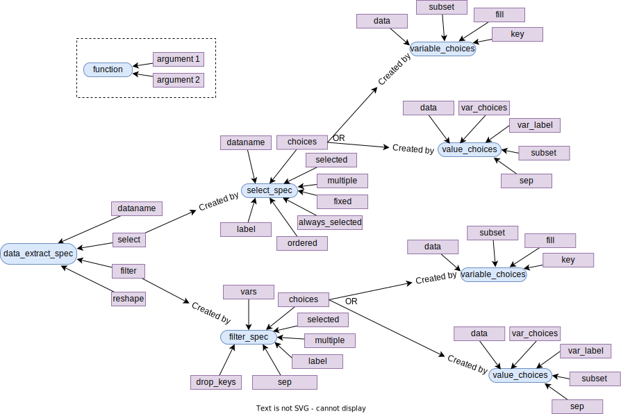

```{r setup, include = FALSE, echo=FALSE}
knitr::opts_chunk$set(
  collapse = TRUE,
  comment = "#>"
)
```

The teal app developer has the capability to provide the level of data transformation options in the teal app.
This vignette provides an overview of how this can be achieved.

### `data_extract_spec` object

All we need to do is provide the required `data_extract_spec` object where it is required by the module.
This object is used by the module to create the UI which the app user can control and server logic that helps in translating the UI into `R` expressions to get the data requested by the app user.

### Creating `data_extract_spec` object

Fundamentally a `data_extract_spec` object has information that would allow to do three things:

1. Select the required columns from the data.
2. Filter the data  based on the user's selection.
3. Reshape the data into long or wide format.

To construct a `data_extract_spec` object use the `data_extract_spec()` function. These helper functions might come handy: `select_spec()`, `filter_spec()`, `variable_choices()`, and `value_choices()`.

You can refer to this diagram to get a quick view of how to use these functions. For more detailed explaination please refer to the function documentation.


