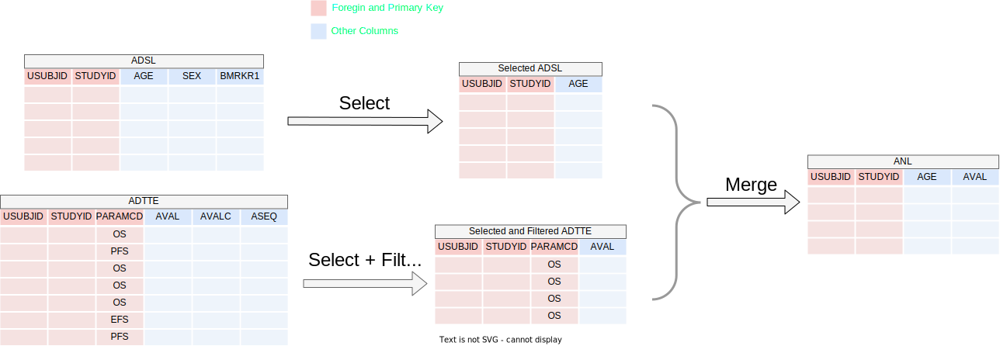

```{r setup, include = FALSE, echo=FALSE}
knitr::opts_chunk$set(
  collapse = TRUE,
  comment = "#>"
)
```

`teal.transform` allows the app user to oversee transforming a relational set of data objects into the final dataset for analysis.
User actions create a R expression that subsets and merges the input data.

In the following example we will create an analysis dataset `ANL` by:

1. Selecting the column `AGE` from `ADSL`
2. Selecting the column `AVAL` and filtering the rows where `PARAMCD` is `OS` from `ADTTE`
3. Merging the results from the above datasets using the primary keys.



Note that primary key columns are maintained when selecting columns from datasets.

Let's see how to achieve this dynamic `select`, `filter`, and `merge` operations in a `shiny` app using `teal.transform`.

#### Step 1/5 - Preparing the Data

```{r library}
library(teal.transform)
library(teal.data)
library(shiny)

# Define data.frame objects
ADSL <- teal.data::rADSL
ADTTE <- teal.data::rADTTE

# create a list of reactive data.frame objects
datasets <- list(
  ADSL = reactive(ADSL),
  ADTTE = reactive(ADTTE)
)

# create join_keys
join_keys <- join_keys(
  join_key("ADSL", "ADSL", c("STUDYID", "USUBJID")),
  join_key("ADSL", "ADTTE", c("STUDYID", "USUBJID")),
  join_key("ADTTE", "ADTTE", c("STUDYID", "USUBJID", "PARAMCD"))
)
```


#### Step 2/5 - Creating data extract specifications

In the following code block, we create a `data_extract_spec` object for each dataset, as illustrated above.
It is created by the `data_extract_spec()` function which takes in four arguments:

1. `dataname` is the name of the dataset to be extracted.
2. `select` helps specify the columns from which we wish to allow the app user to select. It can be generated using the function `select_spec()`. In the case of `ADSL`, we restrict the selection to `AGE`, `SEX`, and `BMRKR1`, with `AGE` being the default selection.
3. `filter` helps specify the values of a variable we wish to filter during extraction. It can be generated using the function `filter_spec()`. In the case of `ADTTE`, we filter the variable `PARAMCD` by allowing users to choose from `CRSD`, `EFS`, `OS`, and `PFS`, with `OS` being the default filter.
4. `reshape` is a boolean which helps to specify if the data needs to be reshaped from long to wide format. By default it is set to `FALSE`.

```{r data_extract_spec}
adsl_extract <- data_extract_spec(
  dataname = "ADSL",
  select = select_spec(
    label = "Select variable:",
    choices = c("AGE", "SEX", "BMRKR1"),
    selected = "AGE",
    multiple = TRUE,
    fixed = FALSE
  )
)

adtte_extract <- data_extract_spec(
  dataname = "ADTTE",
  select = select_spec(
    choices = c("AVAL", "AVALC", "ASEQ"),
    selected = "AVAL",
    multiple = TRUE,
    fixed = FALSE
  ),
  filter = filter_spec(
    vars = "PARAMCD",
    choices = c("CRSD", "EFS", "OS", "PFS"),
    selected = "OS"
  )
)

data_extracts <- list(adsl_extract = adsl_extract, adtte_extract = adtte_extract)
```

#### Step 3/5 - Creating the UI

Here, we define the `merge_ui` function, which will be used to create the UI components for the `shiny` app.

Note that we take in the list of `data_extract` objects as input, and make use of the `data_extract_ui` function to create our UI.

```{r merge_ui}
merge_ui <- function(id, data_extracts) {
  ns <- NS(id)
  sidebarLayout(
    sidebarPanel(
      h3("Encoding"),
      tags$div(
        data_extract_ui(
          ns("adsl_extract"), # must correspond with data_extracts list names
          label = "ADSL extract",
          data_extracts[[1]]
        ),
        data_extract_ui(
          ns("adtte_extract"), # must correspond with data_extracts list names
          label = "ADTTE extract",
          data_extracts[[2]]
        )
      )
    ),
    mainPanel(
      h3("Output"),
      verbatimTextOutput(ns("expr")),
      dataTableOutput(ns("data"))
    )
  )
}
```

#### Step 4/5 - Creating the Server Logic

Here, we define the `merge_srv` function, which will be used to create the server logic for the `shiny` app.

This function takes as arguments the datasets (as a list of reactive `data.frame`), the data extract specifications created above (the `data_extract` list), and the `join_keys` object (read more about the `join_keys` in the [Join Keys vignette of `teal.data`](https://insightsengineering.github.io/teal.data/latest-tag/articles/join-keys.html)).
We make use of the `merge_expression_srv` function to get a reactive list containing merge expression and information needed to perform the transformation - see more in `merge_expression_srv` documentation.
We print this expression in the UI  and also evaluate it to get the final `ANL` dataset which is also displayed as a table in the UI.

```{r merge_srv}
merge_srv <- function(id, datasets, data_extracts, join_keys) {
  moduleServer(id, function(input, output, session) {
    selector_list <- data_extract_multiple_srv(data_extracts, datasets, join_keys)
    merged_data <- merge_expression_srv(
      selector_list = selector_list,
      datasets = datasets,
      join_keys = join_keys,
      merge_function = "dplyr::left_join"
    )
    ANL <- reactive({
      data_list <- lapply(datasets, function(ds) ds())
      eval(envir = list2env(data_list), expr = as.expression(merged_data()$expr))
    })

    output$expr <- renderText(paste(merged_data()$expr, collapse = "\n"))
    output$data <- renderDataTable(ANL())
  })
}
```

#### Step 5/5 - Creating the `shiny` App

Finally, we include `merge_ui` and `merge_srv` in the UI and server components of the `shinyApp`, respectively,
using the `data_extract`s defined in the first code block and the `datasets` object:

```{r shinyapp, eval=FALSE}
shinyApp(
  ui = bslib::page_fluid(merge_ui("data_merge", data_extracts)),
  server = function(input, output, session) {
    merge_srv("data_merge", datasets, data_extracts, join_keys)
  }
)
```

## Try it out in Shinylive

```{r shinylive_url, echo = FALSE, results = 'asis', eval = requireNamespace("roxy.shinylive", quietly = TRUE)}
code <- paste0(c(
  knitr::knit_code$get("library"),
  knitr::knit_code$get("data_extract_spec"),
  knitr::knit_code$get("merge_ui"),
  knitr::knit_code$get("merge_srv"),
  knitr::knit_code$get("shinyapp")
), collapse = "\n")

url <- roxy.shinylive::create_shinylive_url(code)
cat(sprintf("[Open in Shinylive](%s)\n\n", url))
```

```{r shinylive_iframe, echo = FALSE, out.width = '150%', out.extra = 'style = "position: relative; z-index:1"', eval = requireNamespace("roxy.shinylive", quietly = TRUE) && knitr::is_html_output() && identical(Sys.getenv("IN_PKGDOWN"), "true")}
knitr::include_url(url, height = "800px")
```
