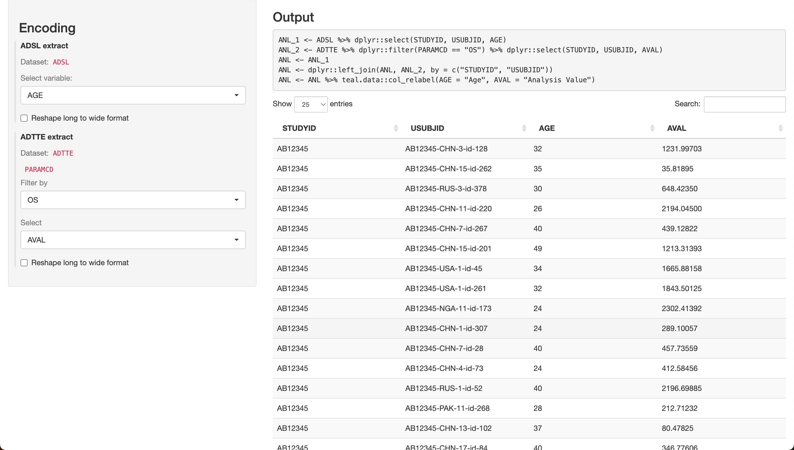

```{r setup, include = FALSE, echo=FALSE}
knitr::opts_chunk$set(
  collapse = TRUE,
  comment = "#>"
)
```

`teal.transform` provides functions that help in transforming the data based on the shiny app user's input from the UI.
The UI inputs are translated into `R` expressions to transform the data for analytical purposes.
This gives the app user flexibility to transform the data as per their requirements.

For example, let's try to create an analysis dataset `ANL` by:

1. Selecting the column `AGE` from `ADSL`
2. Selecting the column `AVAL` and filtering the rows where `PARAMCD` is `OS` from `ADTTE`
3. Merging the results from the above datasets using the primary keys.


Let's see how to achieve this dynamic `select`, `filter`, and `merge` operations in a shiny app using `teal.transform`.

#### Step 1/5 - Creating the data extract

In the following code block, we create a `data_extract_spec` object for each dataset, as illustrated above.

```{r}
library(teal.transform)
library(teal.data)
library(shiny)

adsl_extract <- data_extract_spec(
  dataname = "ADSL",
  select = select_spec(
    label = "Select variable:",
    choices = c("AGE", "BMRKR1"),
    selected = "AGE",
    multiple = TRUE,
    fixed = FALSE
  )
)

adtte_extract <- data_extract_spec(
  dataname = "ADTTE",
  select = select_spec(
    choices = c("AVAL", "ASEQ"),
    selected = "AVAL",
    multiple = TRUE,
    fixed = FALSE
  ),
  filter = filter_spec(
    vars = "PARAMCD",
    choices = c("CRSD", "EFS", "OS", "PFS"),
    selected = "OS"
  )
)

data_extracts <- list(adsl_extract = adsl_extract, adtte_extract = adtte_extract)
```

#### Step 2/5 - Creating the UI

Here, we define the `merge_ui` function, which will be used to create the UI components for the `shiny` app.

Note that we take in the list of `data_extract` objects as input, and make use of the `data_extract_ui` function to create our UI.

```{r}
merge_ui <- function(id, data_extracts) {
  ns <- NS(id)
  sidebarLayout(
    sidebarPanel(
      h3("Encoding"),
      div(
        data_extract_ui(
          ns("adsl_extract"), # must correspond with data_extracts list names
          label = "ADSL extract",
          data_extracts[[1]]
        ),
        data_extract_ui(
          ns("adtte_extract"), # must correspond with data_extracts list names
          label = "ADTTE extract",
          data_extracts[[2]]
        )
      )
    ),
    mainPanel(
      h3("Output"),
      verbatimTextOutput(ns("expr")),
      dataTableOutput(ns("data"))
    )
  )
}
```

#### Step 3/5 - Creating the Server Logic

Here, we define the `merge_srv` function, which will be used to create the server logic for the `shiny` app.

This function gets the `datasets` as a list of reactive `data.frame`, the list of `data_extract` objects, and the `join_keys` object as input.
We make use of the `merge_expression_srv` function to get a reactive list containing merge expression and information needed to perform the transformation - see more in `merge_expression_srv` documentation.
We render this expression and evaluate it to get the final `ANL` dataset which is also rendered as a table in our UI.

```{r}
merge_srv <- function(id, datasets, data_extracts, join_keys) {
  moduleServer(id, function(input, output, session) {
    selector_list <- data_extract_multiple_srv(data_extracts, datasets, join_keys)
    merged_data <- merge_expression_srv(
      selector_list = selector_list,
      datasets = datasets,
      join_keys = join_keys,
      merge_function = "dplyr::left_join"
    )
    ANL <- reactive({
      data_list <- lapply(datasets, function(ds) ds())
      eval(envir = list2env(data_list), expr = as.expression(merged_data()$expr))
    })

    output$expr <- renderText(paste(merged_data()$expr, collapse = "\n"))
    output$data <- renderDataTable(ANL())
  })
}
```

#### Step 4/5 - Preparing the Data

The `data_extract_srv` module depends on a list of reactive or non-reactive `data.frame` objects. 
Here, we demonstrate the usage of a list of reactive `data.frame` objects as input to `datasets`,
along with a list of necessary join keys per `data.frame` object:


```{r}
# Define data.frame objects
ADSL <- teal.transform::rADSL
ADTTE <- teal.transform::rADTTE

# create a list of reactive data.frame objects
datasets <- list(
  ADSL = reactive(ADSL),
  ADTTE = reactive(ADTTE)
)

# create join_keys
join_keys <- join_keys(
  join_key("ADSL", "ADSL", c("STUDYID", "USUBJID")),
  join_key("ADSL", "ADTTE", c("STUDYID", "USUBJID")),
  join_key("ADTTE", "ADTTE", c("STUDYID", "USUBJID", "PARAMCD"))
)
```

#### Step 5/5 - Creating the Shiny App

Finally, we include `merge_ui` and `merge_srv` in the UI and server components of the `shinyApp`, respectively,
using the `data_extract`s defined in the first code block and the `datasets` object:

```{r eval=FALSE}
shinyApp(
  ui = fluidPage(merge_ui("data_merge", data_extracts)),
  server = function(input, output, session) {
    merge_srv("data_merge", datasets, data_extracts, join_keys)
  }
)
```


