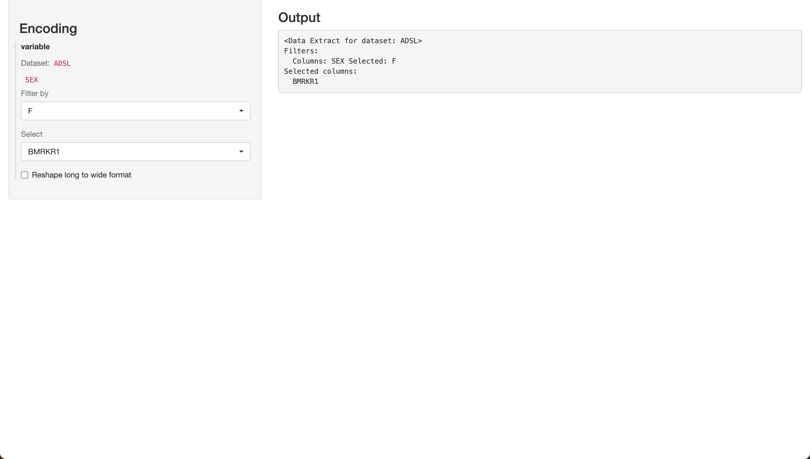

```{r setup, include = FALSE, echo=FALSE}
knitr::opts_chunk$set(
  collapse = TRUE,
  comment = "#>"
)
```

With `teal`, app developers can open up their applications to users, allowing them to decide exactly which app data to 
analyze within the module.

A `teal` module can leverage the use of `data_extract_spec` objects to handle and process the user input.
Examples can be found in the [modules from the `teal.modules.clinical` package](https://insightsengineering.github.io/teal.modules.clinical/latest-tag/reference/index.html).

### `data_extract_spec`

The role of `data_extract_spec` is twofold: to create a UI component in a `shiny` application and to pass user input 
from the UI to a custom server logic that can use this input to transform the data.
Let's delve into how it fulfills both of these responsibilities.

#### Step 1/4 - Preparing the Data

```{r}
library(teal.transform)
library(teal.data)
library(shiny)

# Define data.frame objects
ADSL <- teal.transform::rADSL
ADTTE <- teal.transform::rADTTE

# create a list of reactive data.frame objects
datasets <- list(
  ADSL = reactive(ADSL),
  ADTTE = reactive(ADTTE)
)
# create join_keys
join_keys <- join_keys(
  join_key("ADSL", "ADSL", c("STUDYID", "USUBJID")),
  join_key("ADSL", "ADTTE", c("STUDYID", "USUBJID")),
  join_key("ADTTE", "ADTTE", c("STUDYID", "USUBJID", "PARAMCD"))
)
```

#### Step 2/4 - Creating a `data_extract_spec` Object

Consider the following example, where we create two UI elements, one to filter on a specific level from `SEX` variable,
and a second one to select a variable from `c("BMRKR1", "AGE")`.
`data_extract_spec` object is handed over to the `shiny` app and gives instructions to generate UI components.

```{r}
simple_des <- data_extract_spec(
  dataname = "ADSL",
  filter = filter_spec(vars = "SEX", choices = c("F", "M")),
  select = select_spec(choices = c("BMRKR1", "AGE"))
)
```

#### Step 3/4 - Creating the `shiny` UI and Server Modules

To demonstrate different initialization options of `data_extract_spec`, let's first define a `shiny` module that
utilizes `data_extract_ui` and `data_extract_srv` to handle `data_extract_spec` objects.
This module creates a UI component for a single `data_extract_spec` and prints a list of values returned from the `data_extract_srv` module. 
For more information about `data_extract_ui` and `data_extract_srv`, please refer to the package documentation.

```{r}
extract_ui <- function(id, data_extract) {
  ns <- NS(id)
  sidebarLayout(
    sidebarPanel(
      h3("Encoding"),
      data_extract_ui(ns("data_extract"), label = "variable", data_extract)
    ),
    mainPanel(
      h3("Output"),
      verbatimTextOutput(ns("output"))
    )
  )
}

extract_srv <- function(id, datasets, data_extract, join_keys) {
  moduleServer(id, function(input, output, session) {
    reactive_extract_input <- data_extract_srv("data_extract", datasets, data_extract, join_keys)
    s <- reactive({
      format_data_extract(reactive_extract_input())
    })
    output$output <- renderPrint({
      cat(s())
    })
  })
}
```

#### Step 4/4 - Creating the `shiny` App

Finally, we include `extract_ui` in the UI of the `shinyApp`, and utilize `extract_srv` in the server function of the `shinyApp`:

```{r eval=FALSE}
shinyApp(
  ui = fluidPage(extract_ui("data_extract", simple_des)),
  server = function(input, output, session) {
    extract_srv("data_extract", datasets, simple_des, join_keys)
  }
)
```


